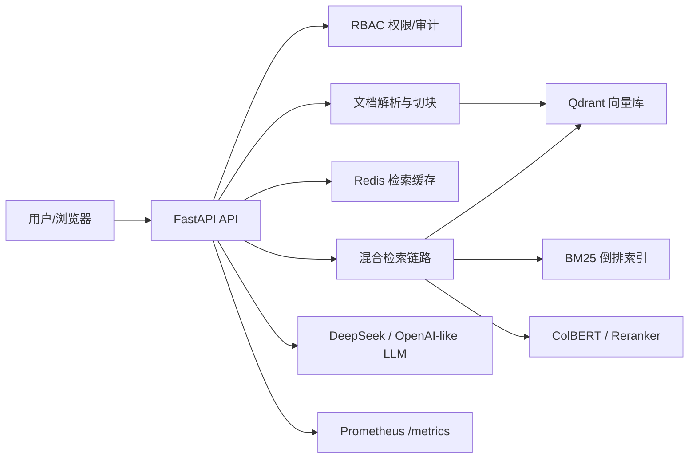

# 企业级 RAG 知识库平台

一个面向企业内部文档问答的 RAG 平台，支持多格式文档解析、权限隔离、审计日志、混合检索、来源追溯、多模式路由、Redis 缓存、Prometheus 监控和 Docker Compose 部署。

English version: [README_EN.md](./README_EN.md)

## 项目预览

| 登录与权限入口 | 知识库工作台 | 上传与文档归属 |
| --- | --- | --- |
|  |  |  |

## 项目亮点

- 多格式解析：PDF、Word、Excel、PPT、TXT、CSV、图片 OCR。
- 权限隔离：共享库/内部库分离，按角色控制可见范围，上传、删除、查看均留痕。
- 混合检索：Dense 向量检索、BM25、BGE-M3 Sparse、RRF 融合、Cross-Encoder Reranker。
- 深度增强：HyDE、Multi-Query、查询分解、ColBERT Late Interaction、Self-RAG、GraphRAG。
- 多模式路由：`fast`、`balanced`、`deep`、`auto`，简单问题走轻链路，复杂问题走深链路。
- 来源可追溯：回答下方展示文件名、页码、chunk 和片段摘要，可直接打开原文。
- 工程化交付：Docker Compose、Redis 缓存、Prometheus 指标、Grafana 数据源、评测脚本。

## 技术栈

- 后端：FastAPI、Python
- 检索：Qdrant、BM25、BGE-M3、bge-reranker-v2-m3
- 可观测性：Prometheus、Grafana
- 缓存：Redis
- 部署：Docker、Docker Compose

## 架构



## 本地启动

```powershell
cd enterprise-rag-platform
pip install -r requirements.txt
python launcher.py
```

默认地址：

- Web: `http://localhost:8400`
- 账号: `admin`
- 密码: `admin123`

首次启动会自动从 `.env.example` 生成 `.env`，并从 `config/users.example.json` 初始化本地用户库。默认配置会尝试加载公开 BGE-M3 / Reranker 模型；如果模型不可用，系统会降级到本地轻量检索回退模式，方便先跑通上传、检索、权限和监控流程。

如需企业内网/离线部署，可在 `.env` 中改为本地模型路径：

```dotenv
HF_HUB_OFFLINE=1
TRANSFORMERS_OFFLINE=1
EMBED_MODEL_NAME=models/BAAI--bge-m3
RERANKER_MODEL_NAME=models/BAAI--bge-reranker-v2-m3
```

## WSL / Conda 启动

适合 Windows + WSL 用户，也方便在独立 Python 环境里演示：

```bash
git clone https://github.com/facty7/enterprise-rag-platform.git
cd enterprise-rag-platform
source ~/miniconda3/etc/profile.d/conda.sh
conda create -n enterprise-rag python=3.12 pip -y
conda activate enterprise-rag
pip install -r requirements.txt
bash scripts/wsl_start.sh
```

默认端口仍是 `8400`。如需切换端口：

```bash
PORT=8500 bash scripts/wsl_start.sh
```

## Docker Compose 部署

```powershell
cd enterprise-rag-platform
docker compose up -d --build
```

服务地址：

- 应用: `http://localhost:8400`
- Prometheus: `http://localhost:9090`
- Grafana: `http://localhost:3000`，默认 `admin/admin`
- Redis: `localhost:6379`

## 评测

生成模拟企业文档并运行基础评测：

```powershell
cd enterprise-rag-platform
python scripts/quick_eval.py
```

对比不同检索模式耗时：

```powershell
cd enterprise-rag-platform
python scripts/evaluate_modes.py
```

输出文件：

- `data/eval_result.json`
- `data/mode_compare_results.json`
- `data/mode_compare_report.md`

## 监控指标

Prometheus 入口：

```text
GET /metrics
```

主要指标：

- `rag_chat_requests_total`
- `rag_chat_latency_seconds`
- `rag_cache_events_total`
- `rag_retrieval_phase_ms`
- `rag_indexed_documents`

## English Summary

This is an enterprise RAG knowledge platform for internal document Q&A. It supports multi-format parsing, RBAC permission isolation, hybrid retrieval, source citation, Docker Compose deployment, Redis caching, and Prometheus metrics.

## 注意

- `.env` 不要提交生产 API Key。
- `config/users.json`、`data/`、`files/`、`models/`、`python/` 都是本地运行产物，不要公开提交。
- 公开仓库建议保留 `config/users.example.json` 作为初始化模板。
- `scripts/run_full_evaluation.py` 中的企业文档和客户名称均为合成样本，仅用于评测演示。
