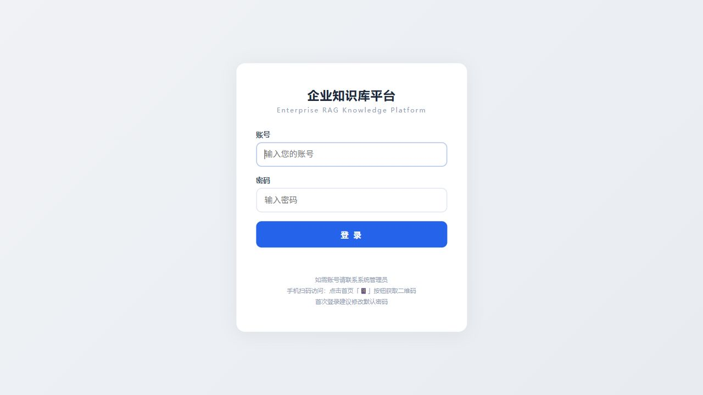

# Enterprise RAG Knowledge Platform

An enterprise knowledge base and document Q&A platform with:

- multi-format document parsing
- RBAC permission isolation
- audit logs
- hybrid retrieval with dense + sparse + BM25 + RRF
- source citation and highlight
- fast / balanced / deep / auto routing
- Redis retrieval cache
- Prometheus metrics
- Docker Compose deployment

## Screenshots

| Login | Workspace | Upload & Permissions |
| --- | --- | --- |
|  |  |  |

## Quick Start

```powershell
cd enterprise-rag-platform
pip install -r requirements.txt
python launcher.py
```

Default demo credentials:

- Username: `admin`
- Password: `admin123`

On first launch the app creates `.env` from `.env.example` and initializes `config/users.json` from `config/users.example.json`. By default it tries to load public BGE-M3 / reranker models. If model loading fails, it falls back to a lightweight local retrieval mode so the upload, search, RBAC, and metrics flow can still be tested.

For offline deployments, point the model names to local paths:

```dotenv
HF_HUB_OFFLINE=1
TRANSFORMERS_OFFLINE=1
EMBED_MODEL_NAME=models/BAAI--bge-m3
RERANKER_MODEL_NAME=models/BAAI--bge-reranker-v2-m3
```

## WSL / Conda

```bash
git clone https://github.com/facty7/enterprise-rag-platform.git
cd enterprise-rag-platform
source ~/miniconda3/etc/profile.d/conda.sh
conda create -n enterprise-rag python=3.12 pip -y
conda activate enterprise-rag
pip install -r requirements.txt
bash scripts/wsl_start.sh
```

## Docker Compose

```powershell
cd enterprise-rag-platform
docker compose up -d --build
```

Ports:

- App: `8400`
- Prometheus: `9090`
- Grafana: `3000`
- Redis: `6379`

## Evaluation

```powershell
python scripts/quick_eval.py
python scripts/evaluate_modes.py
```

## Metrics

Prometheus endpoint:

```text
GET /metrics
```

## Notes

- Do not commit `.env`.
- Keep `config/users.json`, `data/`, `files/`, `models/`, and `python/` out of Git.
